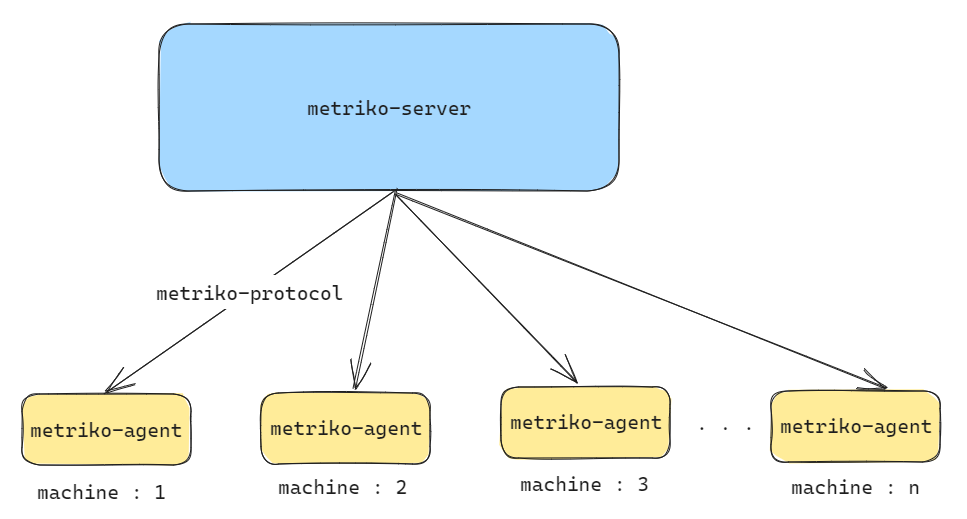

# metriko
server-agent for metric collection .
## Table of Contents

- [00 | Overview](README.md)
- [01 | Intro](#intro)
- [00 | Architecture](#architecture)

## Intro
This project aims to demonstrate the basic server - agents designe through a `distributed metric collecting microservices`. The main features include :

- `Metriko-server` central server that collect data from different machines and store data / send command to different machines identified by their agent ;
- `Metriko-protocol` is used for interaction between agents <-> server, and data encoding/decoding;
- `Metriko-agent` systemd service that push metrics and execute commands sent by the server;

## Architecture 
